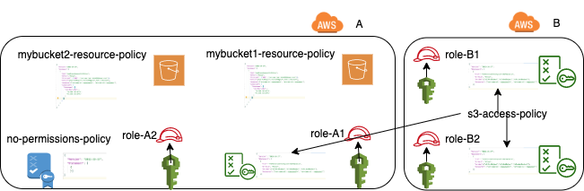

# Cross-Account vs Intra-Account Rules, and What is Root?

In particular, what does the following mean when used as the principal in an IAM resource policy?

```
"Principal": {"AWS": ["arn:aws:iam::111122223333:root]}
```

## Introduction
This lab examines the difference between IAM vs AWS Resource based policies. In particular, we seek to understand the
policy evaluation logic for S3 buckets with cross account access. For a refresher on IAM basics, see
[Reference Policies Evaluation Logic](https://docs.aws.amazon.com/IAM/latest/UserGuide/reference_policies_evaluation-logic.html)
which is valid for when the IAM Principal and S3 Resource are in the same AWS account. 

To summarize the above, if an action is allowed by an identity-based policy, a resource-based policy, or both, then 
AWS allows the action. An explicit deny in either of these policies overrides the allow.

The situation changes for [cross account access](https://aws.amazon.com/premiumsupport/knowledge-center/cross-account-access-s3/). 
In this case, access must be explicitly allowed in both
the picincipal's AWS access policy and the resource policy. Unfortunately, the latter reference does not
mention the confused deputy issue for cross-account access which occurs when the trusted account is a
3rd party SaaS vendor. As a result, many vendors which operate on customer's S3 buckets do so insecurely.

For this lab, we will assume both AWS accounts are owned by the same entity and will leave confused deputy 
issues for Lab 4 - Direct Access vs Assume Role: Granting cross account access to resources.


Granting permissions for Principal-A to access Resource-B when both are in the same account can be done by giving Principal-A
a permissions policy to access Resource-B. Alternatively, cross-account access could be granted in a resource policy 
such as the following bucket policy.


### Assume Role
Assume Role access requires adding statements 
like the following in a role's assume-role trust policy.

IAM Role Assume-Role Trust Policy
```
"Principal":{"AWS":"arn:aws:iam::AWSTargetAccountID:root"}
```

## Setup
In order to test this, you will want two accounts where you have been granted admin, since you will need the ability
to create users, roles and policies. If an instructor wanted to run this in a class without granting full admin, then
a permissions boundary which allows creating roles and users, but not policies could be tailored to this lab following
the [AWS documentation](https://docs.aws.amazon.com/IAM/latest/UserGuide/access_policies_boundaries.html).

```
cp demo-vars.txt vars.txt
session_random=${RANDOM}-${RANDOM}
echo "mybucket=mybucket-$session_random" >> vars.txt
```

Replace the RHS of the following in vars.txt. You can change the cidr_1 to your
personal ip/32. Find you personal IP by typing whatsmyip in the browser.
```.env
internal_account=111122223333 
external account=444455556666 
cidr_1=<my_ip>/32
cidr_2=54.240.144.0/24
```

```.bash
source vars.txt
for file in `ls demo-*.json`; do
output_name=`echo $file | sed 's|demo-||'`
cat $file \
| sed "s|111122223333|$accountA|g" \
| sed "s|444455556666|$accountB|g" \
| sed "s|54.240.143.0/24|$cidr_1|g" \
| sed "s|54.240.144.0/24|$cidr_2|g" \
| sed "s|mybucket|$mybucket|g" \
| sed "s|session_random|$session_random|g" \
> $output_name
done
```

Grant access to any AWS credentials associated with either account replacing policy.json with
assume-role-for-mybucket.json

```.bash
aws s3api create-bucket --bucket $mybucket
aws s3api put-bucket-policy --bucket $mybucket --policy file://s3-resource-cross-account-policy.json
```


Create the 4 roles for the lab, 2 in each account
```bash
export roleA1=roleA1-$rand
export roleA2=roleA2-$rand
export roleB1=roleB1-$rand
export roleB2=roleB2-$rand

aws --profile $profileA iam create-role --role-name $roleA1 \
                            --assume-role-policy-document file://assume-A-policy.json
aws --profile $profileA iam create-role --role-name $roleA2 \
                            --assume-role-policy-document file://assume-A-policy.json
aws --profile $profileB iam create-role --role-name $roleB1 \
                            --assume-role-policy-document file://assume-B-policy.json
aws --profile $profileB iam create-role --role-name $roleB2 \
                            --assume-role-policy-document file://assume-B-policy.json
```

Create the buckets for the lab. Notie that unlike the IAM resources created, the bucket ARN does not include the account ID.
```bash
aws --profile $profileA s3api create-bucket --bucket $mybucket1
aws --profile $profileA s3api create-bucket --bucket $mybucket2
```

Test awsas (the aws_run_as.sh) script. The AWS cli should really have a `aws --run-as role-name` option which
would allow you to assume a role and then run with those credentials like gcp has. Since they
don't it's an awkward manual process to get the temporary creds into ~/.aws/credentials profiles.
We wrote aws_run_as.sh to provide an aws with the --run-as functionality.

```bash
awsas  --profile $profileA  $roleA1 sts get-caller-identity
```
Above, we first switch to the credentials stored in $profile in `~/.aws/credentials` and
then assume the roleA1 before finally calling `aws sts get-caller-identity` (aws omitted in the call).


### 2. Check a role with no permissions can access a bucket with the right bucket policy

Picking up from Readme.ipynb...
Attach the bucket policy to the bucket.
```bash
aws --profile $profileA s3api put-bucket-policy --bucket $mybucket1 \
--policy file://mybucket1_policy.json
```

Test if rolA1 can access it.
```bash
awsas --profile $profileA $roleA1 s3 ls s3://$mybucket1
```

expect
```bash
An error occurred (AccessDenied) when calling the ListObjectsV2 operation: Access Denied
```

Let's try the same with roleA2 which is explicitly allowed in the bucket policy
even though rolaA has no permission policy attached yet.
```bash
awsas --profile $profileA $roleA2 s3 ls s3://$mybucket1
```

expected
```bash
2020-05-03 13:57:39        185 demo-vars.sh
```
The timestamp does not matter, just the file name showing ListBucket worked.


#### 2. Conclusion
Allowing "root" on an S3 policy does not grant access to all principals in the
account, unless the principal also has the permission. However, explicitly allowing 
a specific role in the S3 policy permits access even if the role has no attached 
permissions. This is what we mean when we say "If the principal and the resource 
are in the same account, permission is the union of policies attached to the 
resource and principal."

### 3. Can a role with permissions access a bucket with no bucket policy?

Now let us attach the permission_policy_for_s3 to roleA1. 
For this we need the policy arn. It's in our sourced variables, but 
could be obtained as follows:

```bash
aws --profile $profileA iam list-policies --path-prefix /aws-labs/ | jq '.Policies[].Arn' | sed 's|\"||g'
```

Attach the policy to the role
```bash
aws --profile $profileA iam attach-role-policy --role-name $roleA1 --policy-arn $iam_permission_policy_for_s3_arn
```

First lets verify that roleA1 can now access mybucket1
```bash
awsas --profile $profileA $roleA1 s3 ls s3://$mybucket1
```

expected
```bash
2020-05-03 13:57:39        185 demo-vars.sh
```

Now test that roleA1 with IAM permission policy which allows it to work
with mybucket1 and mybucket2 does not require mybucket2 to have a bucket
policy allowing it.

```bash
awsas --profile $profileA $roleA1 s3 ls s3://$mybucket2
```

expected
```bash
2020-05-03 13:57:40        221 assume_A_policy.json
```

#### 3. Conclusion
We confirmed that an IAM policy attached to a role is all that is required
to access a bucket further supporting the "Union within an account" rule.

### 4. Can roleB1 with explicit IAM policy permission to access mybucket1 in accountA access it?

Let's recall the current mybucket1 policy
```bash
aws --profile $profileA s3api get-bucket-policy --bucket $mybucket1 | sed 's/\\\"/"/g' | sed 's/\"{/{/g' | sed 's/\}\"/\}/g' | jq '.'
```
The s3api returns a string escaped format which is hard to read so all the chained
`sed` commands pretty it up.

```yaml
{
  "Policy": {
    "Version": "2012-10-17",
    "Statement": [
      {
        "Sid": "BucketPolicyForS3ReaderRole",
        "Effect": "Allow",
        "Principal": {
          "AWS": ["arn:aws:iam::111111111111:root",
                  "arn:aws:iam::111111111111:role/roleA2-30873"]
         },
        "Action": ["s3:PutObject", "s3:GetObject", "s3:ListBucket"],
        "Resource": [ "arn:aws:s3:::mybucket1-30873/*",
                      "arn:aws:s3:::mybucket1-30873"
        ]
      }
    ]
  }
}
```

Let's attach a policy which allows roleB1 to access buckets
```yaml
aws --profile $profileB iam attach-role-policy \
                  --role-name $roleB1 --policy-arn $iam_permission_policy_for_s3_arnB
```

```yaml
awsas --profile $profileB $roleB1 s3 ls s3://$mybucket1
```

expect fail. Since roleB1 is in a different account from mybucket1, both resource
policy and IAM permission policy must explicitly grant access.
```yaml
An error occurred (AccessDenied) when calling the ListObjectsV2 operation: Access Denied
```


Now lets try with mybucket2 in accountA after attaching a cross-account policy.
```bash
aws --profile $profileA s3api put-bucket-policy --bucket $mybucket2 \
                                --policy file://mybucket2_policy.json
```

```yaml
awsas --profile $profileB $roleB1 s3 ls s3://$mybucket2
```

expect success. This works because mybucket1 trusts the root of accountB which
means that it trusts the admin of accountB to assign s3 permissions INCLUDING
accessing external accounts.
```yaml
2020-05-03 13:57:40        221 assume_A_policy.json
```

What about roleB2. We haven't attached a permission policy to it yet, but
it is explicitly allowed in mybucket2's resource policy.

```yaml
awsas --profile $profileB $roleB2 s3 ls s3://$mybucket2
```

expect no. Surprise! 
```yaml
An error occurred (AccessDenied) when calling the ListObjectsV2 operation: Access Denied
```
The result is not consistent with the result when the role and s3
bucket are in the same account. For cross-account, even when an s3 bucket explicitly
names a resource from another account, the role must also have the permission attached.


5. Beware of conditional policies

mybucket2_conditional_policy.json

Let's replace the existing mybucket2 bucket policy with following bucket policy
which adds a condition block to restrict access to certain IPs.
```.json
{
  "Version":"2012-10-17",
  "Statement":[
    {
      "Sid":"AddCrossAccountPutPolicy",
      "Effect":"Allow",
      "Principal": {"AWS": ["arn:aws:iam::$accountB:root"]},
      "Action":["s3:PutObject","s3:GetObject","s3:ListBucket"],
      "Resource":["arn:aws:s3:::$mybucket2/*", "arn:aws:s3:::$mybucket2"],
      "Condition": {
        "IpAddress": {
          "aws:SourceIp": [
            "x.y.z.w/32",  # replace with your IP (use whatsmyip in browser)
            "54.240.144.0/24"
          ]
        }
        }
      }
    ]
  }
```

Question:

* Can we list bucket items from non-whitelisted IPs?

TODO 1
Show roleB1 or roleB2 cannot access any more.
Show roleA1 can access because its IAM permission policy is not restricted
and it the decision is based on the union of what the IAM permission policy
allows (yes) and what the s3 bucket policy allows (no). In contrast, for roleBx
the IAM permission policy (yes) intersected with the resrouce policy (no) leads
to a denial of access.

6. The necessity of explicit Deny statements

What if you wish to only allow roleA1 and no other principal access to 
mybucket2? You might try to apply granular roles to all principals in
accountA so that you never granted access to resource * for s3 operations
to any principal. This is difficult to enforce. A better way is to apply
an explicit Deny to all principals except roleA1 in the mybucket2 s3 bucket
policy.

```yaml
{
  "Policy": {
    "Version": "2012-10-17",
    "Statement": [
      {
        "Sid": "ExplicitDenyBucketPolicyForAllBut",
        "Effect": "Deny",
        "Principal": {
          "AWS": ["arn:aws:iam::$accountB:role/$roleB1",
                  "arn:aws:iam::$accountA:role/$roleA2"]
         },
        "Action": ["s3:PutObject", "s3:GetObject", "s3:ListBucket"],
        "Resource": [ "arn:aws:s3:::$mybucket2/*",
                      "arn:aws:s3:::$mybucket2"
        ],
        "Condition": {"ArnNotLike": {
              "aws:SourceArn": ["arn:aws:iam::$accountA:role/$roleA2",
                                "arn:aws:iam::$accountB:role/$roleB2"]}
        }
      },
      {
        "Sid": "AllowCrossAccountForS3MyBucket2",
        "Effect": "Allow",
        "Principal": {
          "AWS": ["arn:aws:iam::$accountB:role/$roleB1"]
         },
        "Action": ["s3:PutObject", "s3:GetObject", "s3:ListBucket"],
        "Resource": [ "arn:aws:s3:::$mybucket2/*",
                      "arn:aws:s3:::$mybucket2"
        ]
      }
    ]
  }
}
```


TODO 2
attach the above policy to bucket2.
show that roleA1 cannot access it but roleA2 can.
show that roleB1 can access as well.

Congratulations! You have finished lab2. 
We summarize the results as follows:

When a role and resource are in the same account permssion is granted if
either the role or resource grants access (union).
When a role and resource are in distinct accounts, permission must be
granted by both the role and the resource (intersection).